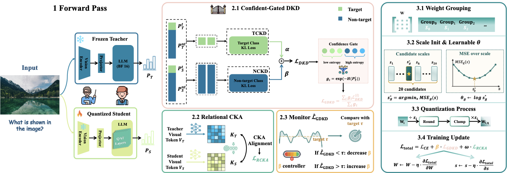

<p align="center">
  
</p>

<h1 align="center">GRACE</h1>

<p align="center"><b>Gated Relational Alignment via Confidence-based Distillation<br/>for Quantization-Aware Training of Vision–Language Models</b></p>

<p align="center">
  📄 <a href="https://arxiv.org/abs/2601.22709"><b>Paper</b></a>
  &nbsp;|&nbsp;
  🤗 <a href="https://huggingface.co/FoeverBLUE"><b>Hugging Face Models</b></a>
  &nbsp;|&nbsp;
  📦 <a href="https://huggingface.co/datasets/Lin-Chen/ShareGPT4V"><b>Training Data</b></a>
</p>

GRACE is a quantization-aware training (QAT) framework for vision–language
models that recovers most of the accuracy lost to low-bit weight quantization
by combining:

- **GDKD** — confidence-gated *Decoupled Knowledge Distillation* (TCKD + NCKD),
  with the trade-off `β` adapted online by an Information-Bottleneck controller.
- **RCKA** — *Relational Centered Kernel Alignment* on penultimate-layer
  visual tokens, aligning the student's relational geometry to the teacher's.
- **Group-wise LSQ QAT** — learned per-group weight scales (W4 / W8,
  group size 128) on the LLM and MLP projector, frozen ViT.

Training optimizes

```
L_total = L_CE  +  β · L_GDKD  +  ω · L_RCKA
```

with `β` driven by an IB controller (`τ`, `η`) and `ω` warmed up linearly.
Defaults follow the values in the paper (Table 6); see
[finetune_qwen3vl_2b_grace.slurm](qwen-vl-finetune/scripts/finetune_qwen3vl_2b_grace.slurm)
for the full hyper-parameter list.

The reference implementation in this repo applies GRACE to
**Qwen3-VL-2B-Instruct** (student) distilled from **Qwen3-VL-8B-Instruct**
(teacher).

<p align="center">
  
</p>

---

## Results

Comparison on 7 VLM benchmarks. The 8B model is the distillation **teacher**
(reference upper bound); all GRACE variants are **2B** students. Best result
among the 2B models is in **bold**.

| Model | Params | Precision | HallB | MMBench | ScienceQA | AI2D | MMMU | SEED | MMStar | Avg |
|:---|:---:|:---:|:---:|:---:|:---:|:---:|:---:|:---:|:---:|:---:|
| Qwen3-VL-8B *(teacher, ref.)* | 8B | BF16 | 61.1 | 84.5 | 85.0 | 85.7 | 69.6 | 77.5 | 70.9 | 76.3 |
| Qwen3-VL-2B *(baseline)*      | 2B | BF16 | 51.4 | 78.4 | 81.4 | 76.9 | 53.4 | 71.2 | 58.3 | 67.3 |
| **Qwen3-VL-2B-GRACE**         | 2B | BF16 | **66.9** | **86.4** | **86.2** | **81.3** | **72.1** | **76.7** | **67.3** | **76.7** |
| Qwen3-VL-2B-GRACE (W8G128)    | 2B | INT8 | 66.1 | 85.5 | 85.3 | 80.4 | 71.3 | 75.9 | 66.5 | 75.9 |
| Qwen3-VL-2B-GRACE (W4G128)    | 2B | INT4 | 65.4 | 84.6 | 84.3 | 79.5 | 70.5 | 75.1 | 65.8 | 75.0 |

> GRACE lifts the 2B baseline by **+9.4 avg** and matches or slightly exceeds
> the 8B teacher on average (76.7 vs 76.3) at roughly 1/4 the parameters.
> The W4G128 (INT4) model retains **98%** of the BF16 average.

---

## Model Zoo

| Model | Bits | Group | HF Hub |
| --- | --- | --- | --- |
| Qwen3-VL-2B-GRACE-BF16   | bf16 | — | [FoeverBLUE/Qwen3-VL-2B-GRACE-BF16](https://huggingface.co/FoeverBLUE/Qwen3-VL-2B-GRACE-BF16) |
| Qwen3-VL-2B-GRACE-W8G128 | int8 | 128 | [FoeverBLUE/Qwen3-VL-2B-GRACE-W8G128](https://huggingface.co/FoeverBLUE/Qwen3-VL-2B-GRACE-W8G128) |
| Qwen3-VL-2B-GRACE-W4G128 | int4 | 128 | [FoeverBLUE/Qwen3-VL-2B-GRACE-W4G128](https://huggingface.co/FoeverBLUE/Qwen3-VL-2B-GRACE-W4G128) |

The BF16 checkpoint is the full-precision SFT baseline used as the initial
student weights for the W8 and W4 GRACE runs.

Quick load:

```python
from transformers import AutoProcessor, Qwen3VLForConditionalGeneration

ckpt = "FoeverBLUE/Qwen3-VL-2B-GRACE-W4G128"
model = Qwen3VLForConditionalGeneration.from_pretrained(ckpt, torch_dtype="auto", device_map="auto")
processor = AutoProcessor.from_pretrained(ckpt)
```

---

## Repository Layout

```
.
├── qwen-vl-finetune/        # Training entry points (SFT, QAT, GRACE)
│   ├── qwenvl/
│   │   ├── data/            # Dataset registry + LLaVA-style loader
│   │   └── train/
│   │       ├── train_qwen.py        # plain BF16 SFT
│   │       ├── train_qwen_qat.py    # group-wise LSQ QAT
│   │       ├── train_qwen_grace.py  # GRACE = QAT + GDKD + RCKA
│   │       ├── qat_modules.py       # LSQ fake-quant + save hooks
│   │       └── grace_modules.py     # GDKD, RCKA, IB controller
│   └── scripts/
│       ├── finetune_qwen3vl_2b_bf16.slurm   # BF16 SFT (baseline)
│       ├── finetune_qwen3vl_2b_sft.slurm    # BF16 SFT (alt config)
│       ├── finetune_qwen3vl_2b_qat.slurm    # QAT only (ablation)
│       └── finetune_qwen3vl_2b_grace.slurm  # GRACE
├── evaluation/              # lmms-eval driver + per-benchmark configs
├── qwen-vl-utils/           # Qwen3-VL multi-modal preprocessing helpers
├── cookbooks/               # Qwen3-VL inference / capability demos
├── docker/                  # CUDA 12.8 image for web demo
├── web_demo_mm.py           # Multi-modal Gradio demo
├── assets/                  # README figures (architecture, icon)
└── requirements.txt         # Pinned versions for the qwen3vl venv
```

---

## Environment Setup

GRACE was trained on the CINECA Leonardo cluster (A100-80GB nodes). The
reference SLURM scripts pin the host toolchain in their `module load` block:

| Component | Version |
| --- | --- |
| CUDA driver / runtime (host) | **12.3** |
| GCC                          | **12.2.0** |
| Python                       | **3.11** |
| PyTorch                      | **2.5.1** (cu121 wheels — forward-compatible with CUDA 12.3 driver) |
| flash-attn                   | **2.7.2.post1** |
| DeepSpeed                    | **0.15.4** (ZeRO-2) |
| transformers                 | **5.9.0** |
| accelerate                   | **1.13.0** |

A frozen export of the full virtual environment is in
[requirements.txt](requirements.txt).

### Build the venv from scratch

```bash
# 1) System modules (Leonardo example — adapt to your cluster)
module purge
module load profile/deeplrn
module load cuda/12.3
module load gcc/12.2.0

# 2) Create venv
python3.11 -m venv ${HOME}/qwen3vl
source ${HOME}/qwen3vl/bin/activate
pip install -U pip wheel setuptools

# 3) PyTorch + CUDA runtime (cu121 wheels)
pip install torch==2.5.1 torchvision==0.20.1 \
    --index-url https://download.pytorch.org/whl/cu121

# 4) Everything else (pinned to the released training env)
pip install -r requirements.txt

# 5) flash-attn — must build AFTER torch is installed
pip install flash-attn==2.7.2.post1 --no-build-isolation

# 6) Local utility package (image / video preprocessing for Qwen3-VL)
pip install -e qwen-vl-utils/
```

### Compute-node environment variables

Many HPC compute nodes have no internet. The reference scripts default to
fully offline HF / W&B:

```bash
export HF_HOME=/path/to/scratch/hf_cache
export TRANSFORMERS_CACHE=${HF_HOME}
export HF_DATASETS_CACHE=${HF_HOME}
export HF_HUB_OFFLINE=1
export TRANSFORMERS_OFFLINE=1
export HF_DATASETS_OFFLINE=1
export WANDB_MODE=offline
```

Pre-stage models on the login node (or any internet-reachable host):

```bash
huggingface-cli download Qwen/Qwen3-VL-2B-Instruct \
    --local-dir ${SCRATCH_ROOT}/Qwen3-VL-2B-Instruct
huggingface-cli download Qwen/Qwen3-VL-8B-Instruct \
    --local-dir ${SCRATCH_ROOT}/Qwen3-VL-8B-Instruct
```

---

## Data Preparation

GRACE is trained on the two ShareGPT4V annotation files (LLaVA-style schema,
`image` + `conversations[from/value]`):

| # | Annotation JSON | Size | Hugging Face |
| - | --- | ---: | --- |
| 1 | `sharegpt4v_instruct_gpt4-vision_cap100k.json` | 134 MB | [Lin-Chen/ShareGPT4V](https://huggingface.co/datasets/Lin-Chen/ShareGPT4V/blob/main/sharegpt4v_instruct_gpt4-vision_cap100k.json) |
| 2 | `sharegpt4v_mix665k_cap23k_coco-ap9k_lcs3k_sam9k_div2k.json` | 1.2 GB | [Lin-Chen/ShareGPT4V](https://huggingface.co/datasets/Lin-Chen/ShareGPT4V/blob/main/sharegpt4v_mix665k_cap23k_coco-ap9k_lcs3k_sam9k_div2k.json) |

`sharegpt4v_mix665k_*` is the main SFT mix used in the paper;
`sharegpt4v_instruct_gpt4-vision_cap100k.json` is the original GPT-4V
caption set.

### 1. Download annotation JSONs

```bash
export SHAREGPT4V_ROOT=/path/to/ShareGPT4V
mkdir -p "${SHAREGPT4V_ROOT}"

huggingface-cli download Lin-Chen/ShareGPT4V \
    sharegpt4v_instruct_gpt4-vision_cap100k.json \
    sharegpt4v_mix665k_cap23k_coco-ap9k_lcs3k_sam9k_div2k.json \
    --repo-type dataset \
    --local-dir "${SHAREGPT4V_ROOT}"
```

### 2. Download the image archives

The ShareGPT4V annotations point at images under `${SHAREGPT4V_ROOT}/data/`.
Download and unpack the following sources (only the ones the JSONs actually
reference are required):

| Source | URL |
| --- | --- |
| LAION-CC-SBU-558K | [images.zip](https://huggingface.co/datasets/liuhaotian/LLaVA-Pretrain/blob/main/images.zip) |
| COCO              | [train2017.zip](http://images.cocodataset.org/zips/train2017.zip) |
| SAM (subset)      | [segment-anything-downloads](https://ai.meta.com/datasets/segment-anything-downloads/) — `000000~000050.tar`. For SFT-only you can take the 9k subset [here](https://drive.google.com/file/d/1dKumdOKSXtV7lIXdrG7jsIK_z2vZv2gs/view?usp=drive_link). |
| GQA               | [images.zip](https://downloads.cs.stanford.edu/nlp/data/gqa/images.zip) |
| OCR-VQA           | [download script](https://drive.google.com/drive/folders/1_GYPY5UkUy7HIcR0zq3ZCFgeZN7BAfm_?usp=sharing) — save all as `.jpg` |
| TextVQA           | [train_val_images.zip](https://dl.fbaipublicfiles.com/textvqa/images/train_val_images.zip) |
| Visual Genome     | [part1](https://cs.stanford.edu/people/rak248/VG_100K_2/images.zip), [part2](https://cs.stanford.edu/people/rak248/VG_100K_2/images2.zip) |
| WebData (academic use only) | [drive folder](https://drive.google.com/drive/folders/1tCUQ-sq6vdshZVkF0ZeF3K4eztkXJgax?usp=sharing) |

### 3. Final directory layout

```
${SHAREGPT4V_ROOT}/
├── sharegpt4v_instruct_gpt4-vision_cap100k.json
├── sharegpt4v_mix665k_cap23k_coco-ap9k_lcs3k_sam9k_div2k.json
└── data/
    ├── llava/llava_pretrain/images/
    ├── coco/train2017/
    ├── sam/images/
    ├── gqa/images/
    ├── ocr_vqa/images/
    ├── textvqa/train_images/
    ├── vg/VG_100K/
    ├── vg/VG_100K_2/
    ├── share_textvqa/images/
    ├── web-celebrity/images/
    ├── web-landmark/images/
    └── wikiart/images/
```

The dataset registry that resolves these paths lives in
[qwen-vl-finetune/qwenvl/data/__init__.py](qwen-vl-finetune/qwenvl/data/__init__.py)
— it reads `SHAREGPT4V_ROOT` from the environment.

---

## Training

### 1. BF16 SFT baseline (optional — also our released `*-BF16` checkpoint)

```bash
sbatch qwen-vl-finetune/scripts/finetune_qwen3vl_2b_bf16.slurm
```

### 2. QAT-only baseline (ablation of GRACE without distillation)

```bash
# W4 G128
sbatch qwen-vl-finetune/scripts/finetune_qwen3vl_2b_qat.slurm
# W8 G128
sbatch --export=ALL,QAT_BITS=8 qwen-vl-finetune/scripts/finetune_qwen3vl_2b_qat.slurm
```

### 3. GRACE (full method)

```bash
# W4 G128 — produces FoeverBLUE/Qwen3-VL-2B-GRACE-W4G128
sbatch qwen-vl-finetune/scripts/finetune_qwen3vl_2b_grace.slurm

# W8 G128 — produces FoeverBLUE/Qwen3-VL-2B-GRACE-W8G128
sbatch --export=ALL,QAT_BITS=8 qwen-vl-finetune/scripts/finetune_qwen3vl_2b_grace.slurm
```

Common env-var overrides (all scripts):

| Variable | Default | Description |
| --- | --- | --- |
| `SHAREGPT4V_ROOT` | `PATH_TO_SHAREGPT4V_ROOT` | Root of ShareGPT4V tree. |
| `DATASETS` | `sharegpt4v_mix665k` | Comma-separated, `%NN` suffix downsamples. |
| `MODEL_NAME_OR_PATH` | `${SCRATCH_ROOT}/Qwen3-VL-2B-Instruct` | Student init. |
| `TEACHER_MODEL_PATH` | `${SCRATCH_ROOT}/Qwen3-VL-8B-Instruct` | GRACE only. |
| `QAT_BITS` / `QAT_GROUP_SIZE` | `4` / `128` | LSQ fake-quant config. |
| `OUTPUT_DIR` | `${CKPT_ROOT}/${RUN_NAME}` | Auto-resumes from latest `checkpoint-*`. |

GRACE-specific knobs (defaults follow the paper):

| Variable | Default | Meaning |
| --- | --- | --- |
| `DKD_TEMPERATURE` | `2.0` | KD temperature `T`. |
| `DKD_ALPHA` / `DKD_BETA` | `1.0` / `4.0` | TCKD / NCKD weights. |
| `RCKA_WEIGHT` | `3.0` | `ω` for L_RCKA. |
| `RCKA_LAYER` | `-2` | Hidden-state index for RCKA. |
| `IB_TAU` / `IB_ETA` | `3.0` / `0.003` | IB controller target / step size. |
| `IB_BETA_INIT/MIN/MAX` | `0.5` / `0.1` / `1.0` | `β` schedule bounds. |
| `RCKA_WARMUP_STEPS` | `400` | Linear warmup for RCKA. |

The full reference run uses 4 × 4 × A100-80GB, DeepSpeed ZeRO-2, BF16,
effective batch 512. Adjust `--nodes`, `PER_DEVICE_BATCH`, and `GRAD_ACCUM`
to fit your cluster.

---

## Evaluation

We score every checkpoint via [lmms-eval](https://github.com/EvolvingLMMs-Lab/lmms-eval).
Per-benchmark configs live under [evaluation/](evaluation/); a multi-suite
driver is at [evaluation/eval_lmms_three.slurm](evaluation/eval_lmms_three.slurm).

```bash
# Example: evaluate the released W4 checkpoint
sbatch --export=ALL,MODEL=FoeverBLUE/Qwen3-VL-2B-GRACE-W4G128 \
       evaluation/eval_lmms_three.slurm
```

---

## Citation

If you use GRACE or the released checkpoints in your research, please cite:

```bibtex
@article{chen2026gated,
  title   = {Gated Relational Alignment via Confidence-based Distillation for Efficient VLMs},
  author  = {Chen, Yanlong and Habibian, Amirhossein and Benini, Luca and Li, Yawei},
  journal = {arXiv preprint arXiv:2601.22709},
  year    = {2026},
  url     = {https://arxiv.org/abs/2601.22709}
}
```

---

## Acknowledgements

GRACE builds on the public Qwen3-VL release and the
[Qwen2.5-VL fine-tuning code](https://github.com/QwenLM/Qwen2.5-VL/tree/main/qwen-vl-finetune).
The ShareGPT4V training data is from
[Lin-Chen/ShareGPT4V](https://huggingface.co/datasets/Lin-Chen/ShareGPT4V).
Evaluation is powered by [lmms-eval](https://github.com/EvolvingLMMs-Lab/lmms-eval).

## License

This project is released under the Apache 2.0 license — see [LICENSE](LICENSE).
The Qwen3-VL base model weights are governed by their own license; the
ShareGPT4V images are restricted to academic use.
